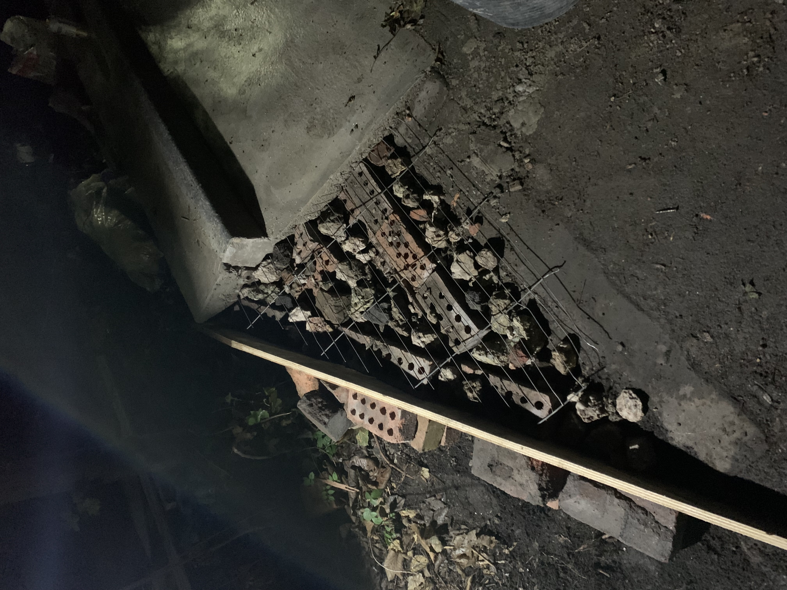

import ImageLightbox from "../../components/ImageLightbox.astro";

    
    

        

            <ImageLightbox src="/images/bank2curb_wings/leftwing_backfill.jpeg" gallery="backfill" />
            <ImageLightbox src="/images/bank2curb_wings/rightwing_backfill2.jpeg" gallery="backfill" />
            {/*  */}
            {/* <ImageLightbox src="/images/bank2curb_wings/rightwing_backfill.jpeg" gallery="" /> */}
            {/*  */}
        

        
{`
            Although the curbs, deck and bank were set and curing nicely through the late summer days, the obstacle was not finished. To be able to take advantage of 100% of the grindable curb space, wings would be required and I hardly delayed in getting them in.
        `}

        

            {/* <ImageLightbox src="/images/bank2curb_wings/leftwing_backfill4.jpeg" gallery="soil" /> */}
            <ImageLightbox src="/images/bank2curb_wings/backfill_soil_right.jpeg" gallery="soil" />
            <ImageLightbox src="/images/bank2curb_wings/backfill_soil_left.jpeg" gallery="soil" />
        

        
        
{`
            Wednesday 27th, I had the shuttering figured out and the backfill and heras rebar prepared. Thursday 28th after work, I was ready to go and managed to get a hand from Yangchen, who exchanged his help for an interview for his dissertation.
        `}

        
        

            <ImageLightbox src="/images/bank2curb_wings/yang_shov.jpeg" gallery="yang" />
            <ImageLightbox src="/images/bank2curb_wings/yang_shov2.jpeg" gallery="yang" />
        

        
        
{`
            We were concreting at 7.30 and since the right wing went in quickly and Yangchen was down for more we pressed on and got the left wing done on the same night, finishing around 10.30. 
        `}

        
        

            <ImageLightbox src="/images/bank2curb_wings/yang_wing.jpeg" gallery="yang-finish" />
            <ImageLightbox src="/images/bank2curb_wings/yang_wing2.jpeg" gallery="yang-finish" />
            <ImageLightbox src="/images/bank2curb_wings/yang_wing3.jpeg" gallery="yang-finish" />
        

        

            <ImageLightbox src="/images/bank2curb_wings/yang2.jpeg" gallery="name" />
            <ImageLightbox src="/images/bank2curb_wings/yang3.jpeg" gallery="name" />
        
  

        
{`
            I hadn’t made up my mind whether to make the wings into a roll on grind but Yangchen wanted it so I went with it and was pleased with the result so I asked him to write the Chinese characters of his name on the roll on grind as a momento. 
        `}

        

            <ImageLightbox src="/images/bank2curb_wings/next_wings.jpeg" gallery="next" />
            <ImageLightbox src="/images/bank2curb_wings/next_wings_left.jpeg" gallery="next" />
        

          
        <ImageLightbox src="/images/bank2curb_wings/next_wings2.jpeg" gallery="next" />
        
        <h2>Reflections</h2>

        

            <ImageLightbox src="/images/bank2curb_wings/lacquered.jpeg" gallery="finish" />
            <ImageLightbox src="/images/bank2curb_wings/dried.jpeg" gallery="finish" />
        
  

    

